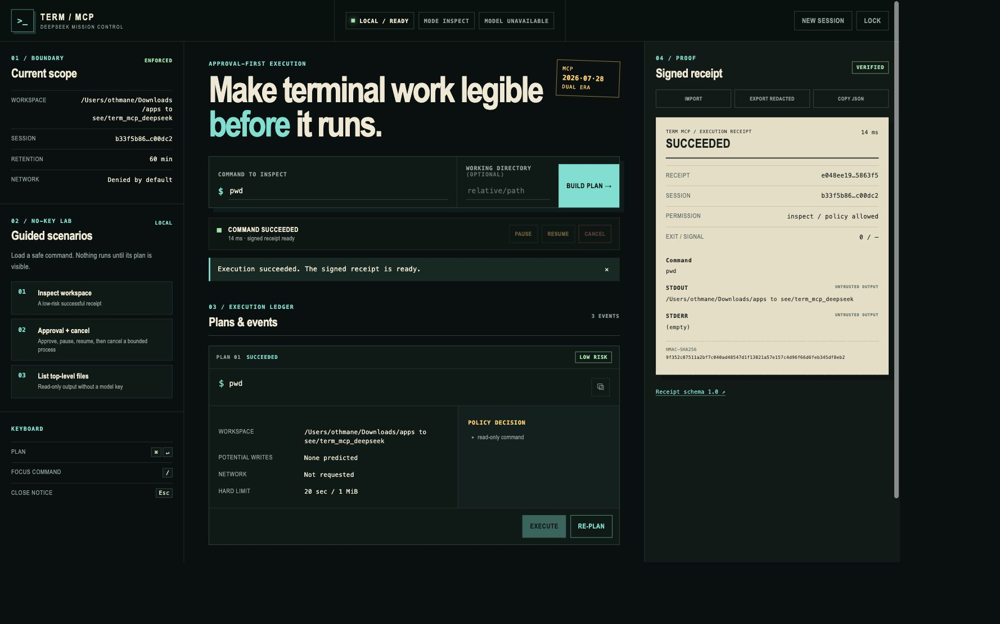

# Term MCP DeepSeek

[](https://github.com/OthmaneBlial/term_mcp_deepseek/actions/workflows/ci.yml)
[](https://github.com/OthmaneBlial/term_mcp_deepseek/actions/workflows/ci.yml)
[](https://github.com/OthmaneBlial/term_mcp_deepseek/actions/workflows/security.yml)
[](https://github.com/OthmaneBlial/term_mcp_deepseek/actions/workflows/codeql.yml)
[](https://github.com/OthmaneBlial/term_mcp_deepseek/releases/latest)
[](https://github.com/OthmaneBlial/term_mcp_deepseek/releases)
[](docs/MCP_COMPATIBILITY.md)

**See the command, risk, workspace, and limits before anything runs. Then keep a signed receipt of what actually happened.**

Term MCP DeepSeek is a local, approval-first terminal control plane for MCP clients and humans. It gives DeepSeek an isolated advisory role while deterministic policy owns command planning, approval, bounded execution, live events, and signed evidence.



## Why this project

Most terminal agents collapse suggestion and execution into one opaque moment. Term MCP DeepSeek makes the boundary visible:

```text
intent → versioned plan → policy decision → human approval → bounded process → signed receipt
```

- Model text never executes directly.
- Inspect mode is read-only by default.
- Every command is parsed without a shell and scoped to one workspace.
- Pause, resume, cancel, timeout, output limits, and process isolation are first-class states.
- DeepSeek can be absent or offline without disabling local MCP tools.
- Receipts separate command, stdout, stderr, exit code, signal, permission, and signature.
- Shareable exports remove command text, workspace paths, arguments, and output, then receive a new valid signature.

## First result in 60 seconds

Requirements: macOS or Linux, Python 3.10–3.13, and [pipx](https://pipx.pypa.io/).

```bash
pipx install "git+https://github.com/OthmaneBlial/term_mcp_deepseek.git@v0.10.0"
cd /path/to/the/repository/you/want/to/inspect
term-mcp serve
```

The server prints a one-time bearer token. Open [http://127.0.0.1:8000](http://127.0.0.1:8000), paste that token, choose **Inspect workspace**, then select **Build plan** and **Execute**.

Expected result: the UI shows a low-risk `pwd` plan before execution, then a `succeeded` receipt with exit code `0`, separate stdout/stderr, and a verified HMAC signature. No DeepSeek key is required.

Stop the server with `Ctrl+C`. The generated token and in-memory sessions disappear with the process.

## Install from a clone

Use this path when contributing or testing unreleased changes:

```bash
git clone https://github.com/OthmaneBlial/term_mcp_deepseek.git
cd term_mcp_deepseek
./startup.sh token
./startup.sh
```

`startup.sh` creates `.venv`, installs the package, and delegates to the same `term-mcp` CLI used by packaged installations.

## Safety boundary

The default is `APPROVAL_MODE=inspect` with network disabled.

| Mode | Intended use | Writes | Project code | Approval |
| --- | --- | --- | --- | --- |
| `inspect` | Repository discovery | Blocked | Blocked | Long-running processes only |
| `confirm` | Deliberate local work | Policy-scoped | Allowed by policy | Required for risky actions |
| `trusted` | Pre-approved automation | Policy-scoped | Allowed by policy | Pre-approved, always receipted |

Confirm and trusted modes are not an operating-system sandbox. Test untrusted repositories in a disposable container or VM. Keep `WORKSPACE_ROOT` narrow, `ALLOW_NETWORK=false`, and never expose the HTTP service directly to an untrusted network.

Read [SECURITY.md](SECURITY.md) and the [threat model](docs/THREAT_MODEL.md) before enabling a wider command surface.

## CLI

```text
term-mcp serve                       production HTTP server (Waitress)
term-mcp serve --debug               Flask development server
term-mcp stdio                       JSON-RPC over STDIO
term-mcp doctor --json               config, permissions, shell, and transport checks
term-mcp doctor --connectivity        optional DeepSeek endpoint check
term-mcp demo                        no-key guided scenarios
term-mcp receipt validate FILE       schema and HMAC validation
term-mcp receipt show FILE           privacy-aware summary
term-mcp recipe validate FILE...     schema and policy validation
term-mcp recipe run FILE             inspect-only recipe execution
term-mcp token                       strong bearer token generator
term-mcp version                     installed version
```

Run a complete local quality gate with:

```bash
./local_ci.sh
```

## Safe recipe catalog

The repository includes five small workflows for repository inspection, test discovery, log inventory, port configuration, and proof of the read-only boundary. Every recipe is schema-versioned, inspect-only, network-free, write-free, bounded, and checked by the production policy before it can run.

```bash
term-mcp recipe validate examples/recipes/*.json --workspace .
term-mcp recipe run examples/recipes/inspect-repository.json --workspace .
```

Browse the [recipe catalog and contribution template](examples/README.md). CI executes the complete catalog and runs the [no-model benchmark](docs/BENCHMARKS.md).

See the [proof gallery](docs/GALLERY.md) for signed, sharing-redacted success, cancellation, and timeout receipts. The [three short demos](docs/DEMOS.md) apply the recipes to an unfamiliar repository, a test surface, and local incident evidence.

## MCP clients

The server targets modern MCP `2026-07-28` and supports the legacy `2025-11-25` initialize lifecycle. HTTP and STDIO share one dispatcher and tool catalog.

Recommended local STDIO configuration:

```json
{
  "mcpServers": {
    "term-mcp-deepseek": {
      "command": "/absolute/path/to/term-mcp",
      "args": ["stdio"],
      "env": {
        "WORKSPACE_ROOT": "/absolute/path/to/your/project",
        "APPROVAL_MODE": "inspect"
      }
    }
  }
}
```

STDOUT contains JSON-RPC messages only; diagnostics go to STDERR. See the [MCP compatibility matrix](docs/MCP_COMPATIBILITY.md) for protocol details and dated client evidence.

## HTTP and web API

Protected routes require `Authorization: Bearer $AUTH_TOKEN`. Public routes are intentionally limited to the UI shell, health, demos, static assets, and receipt schema.

| Method | Path | Auth | Purpose |
| --- | --- | --- | --- |
| `GET` | `/health` | Public | Readiness and package version |
| `GET` | `/` | Public | Approval-first mission control |
| `GET` | `/demo/scenarios` | Public | No-key local demo catalog |
| `GET` | `/schemas/receipt-1.0.json` | Public | Receipt JSON Schema |
| `POST` | `/mcp` | Bearer | Modern or legacy MCP calls |
| `DELETE` | `/mcp` | Bearer | Close a legacy MCP transport session |
| `GET` | `/mcp/info` | Bearer | Runtime, limits, model, and protocol information |
| `POST` | `/sessions` | Bearer | Create an isolated web execution session |
| `DELETE` | `/sessions/{id}` | Bearer | Close a web session and stop its process |
| `GET` | `/stream?session_id=...` | Bearer | Session-scoped execution events |
| `POST` | `/chat` | Bearer | Advisory DeepSeek text; never execution |
| `POST` | `/receipts/validate` | Bearer | Validate schema and local signature |
| `POST` | `/receipts/redact` | Bearer | Remove private content and re-sign for sharing |

The `/sessions`, `/stream`, and `/chat` routes are web compatibility APIs, not separate MCP transports.

## Docker

The image uses a pinned Python base, builds wheels in a separate stage, installs without network in the runtime stage, and runs as UID/GID `10001`.

```bash
export AUTH_TOKEN="$(python3 -c 'import secrets; print(secrets.token_urlsafe(32))')"
docker compose up --build
```

Open [http://127.0.0.1:8000](http://127.0.0.1:8000). The compose workspace mount is read-only because the default mode is inspect. Stop with `docker compose down`.

## Configuration

The no-key defaults are enough for local inspection. Copy `.env.example` only when persistent configuration is useful:

```bash
cp .env.example .env
term-mcp token
term-mcp doctor
```

Do not commit `.env`. Add `DEEPSEEK_API_KEY` only for the optional advisor panel. The complete variable reference and deployment/rollback guidance are in [operations](docs/OPERATIONS.md).

## Project map

| Area | Source of truth |
| --- | --- |
| Product and trust boundaries | [Architecture](docs/ARCHITECTURE.md) |
| Supported and unsupported behavior | [Feature matrix](docs/FEATURES.md) |
| MCP versions and clients | [Compatibility](docs/MCP_COMPATIBILITY.md) |
| Deployment and rollback | [Operations](docs/OPERATIONS.md) |
| Security assumptions | [Security policy](SECURITY.md) and [threat model](docs/THREAT_MODEL.md) |
| Safe examples | [Recipe catalog](examples/README.md) |
| Receipts and concrete demos | [Proof gallery](docs/GALLERY.md) and [demo scripts](docs/DEMOS.md) |
| Local performance evidence | [Benchmark contract](docs/BENCHMARKS.md) |
| Adoption without telemetry | [Adoption evidence](docs/ADOPTION.md) |
| Direction and acceptance criteria | [Roadmap](ROADMAP.md) |
| Release history | [Changelog](CHANGELOG.md) |

## Contributing

Small tests, protocol fixtures, safe recipes, accessibility improvements, and client compatibility reports are welcome. Start with [CONTRIBUTING.md](CONTRIBUTING.md), run `./local_ci.sh`, and include a redacted receipt when a terminal-execution bug produces one.

Security vulnerabilities belong in GitHub private vulnerability reporting, never in a public issue.

## License

MIT — see [LICENSE](LICENSE).
