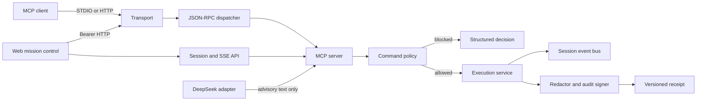
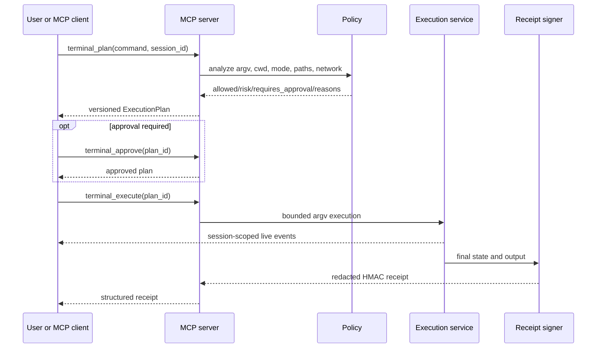

# Architecture

Term MCP DeepSeek is one policy engine with two MCP transports and one human-facing web console. The DeepSeek adapter is optional and cannot bypass the execution path.

## Invariants

1. Model output is data, never an execution trigger.
2. `terminal_plan` always precedes `terminal_execute`.
3. A plan carries its command, resolved workspace, policy decision, risk, and hard limits.
4. Approval is a state transition tied to a plan ID and session ID.
5. Execution uses `subprocess.Popen` with an argv list, no shell, a reduced environment, one process group, a timeout, and output limits.
6. Every final execution state produces a signed receipt.
7. HTTP access fails closed without a strong bearer token; STDIO is authorized by the parent process.
8. SSE subscribers are isolated per execution session and removed on disconnect or expiry.

## Layers

| Layer | Main files | Responsibility |
| --- | --- | --- |
| Configuration | `term_mcp_deepseek/config.py` | Typed environment parsing and fail-closed validation |
| HTTP transport | `term_mcp_deepseek/app.py`, `api/routes.py` | Auth, origin policy, rate limits, headers, web compatibility routes |
| STDIO transport | `term_mcp_deepseek/stdio.py` | JSON lines on stdout, diagnostics on stderr, EOF lifecycle |
| MCP contract | `term_mcp_deepseek/protocol.py`, `tools/json_rpc.py` | Modern metadata, legacy initialize, dispatch, structured errors |
| Product API | `term_mcp_deepseek/server.py` | Tools, prompts, resources, discovery, model conversation isolation |
| Policy | `term_mcp_deepseek/policy.py` | Workspace, executable, path, network, shell-composition, and mode decisions |
| Execution | `term_mcp_deepseek/execution.py` | Session state, process lifecycle, pause/resume/cancel, limits |
| Evidence | `term_mcp_deepseek/audit.py`, `term_mcp_deepseek/receipts.py` | Secret redaction, schema validation, HMAC signing, share-safe exports |
| Live state | `models/event_bus.py` | Bounded per-subscriber queues and cleanup |
| UI | `term_mcp_deepseek/static/` | Local-only approval console; no CDN or model-side execution |

## Execution sequence

## Session model

Execution sessions are UUIDs with an inactivity timeout and a maximum concurrent-session count. Each session owns plans, receipts, one active process at most, and its SSE subscribers. Closing or expiring a session terminates its active process group and removes event queues.

Legacy MCP HTTP transport sessions are separate from execution sessions. Modern `2026-07-28` MCP requests are stateless at the transport layer and carry protocol metadata on every request.

## Receipt model

The `1.0` receipt schema records what ran, where, under which mode and policy, when it started and ended, its status, duration, exit/signal, bounded stdout/stderr, truncation, and HMAC signature.

The normal receipt is already scrubbed for configured secrets and common secret assignments. The share-export endpoint additionally replaces command, cwd, argv, stdout, and stderr with redaction markers, adds `sharing_redacted: true`, and signs the transformed receipt again.

## Deliberate non-goals

- No shell-compatible command language.
- No remote multi-tenant service guarantee.
- No claim that confirm/trusted mode safely executes hostile project code on the host.
- No mandatory telemetry.
- No automatic execution of commands suggested by DeepSeek.
